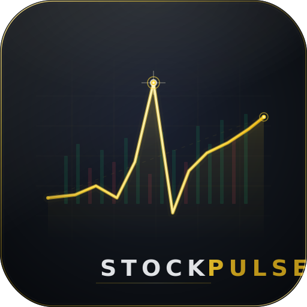
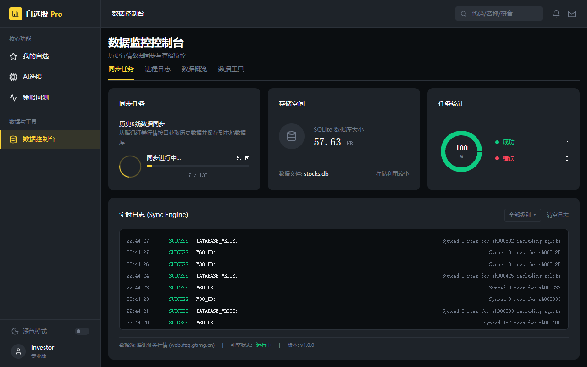
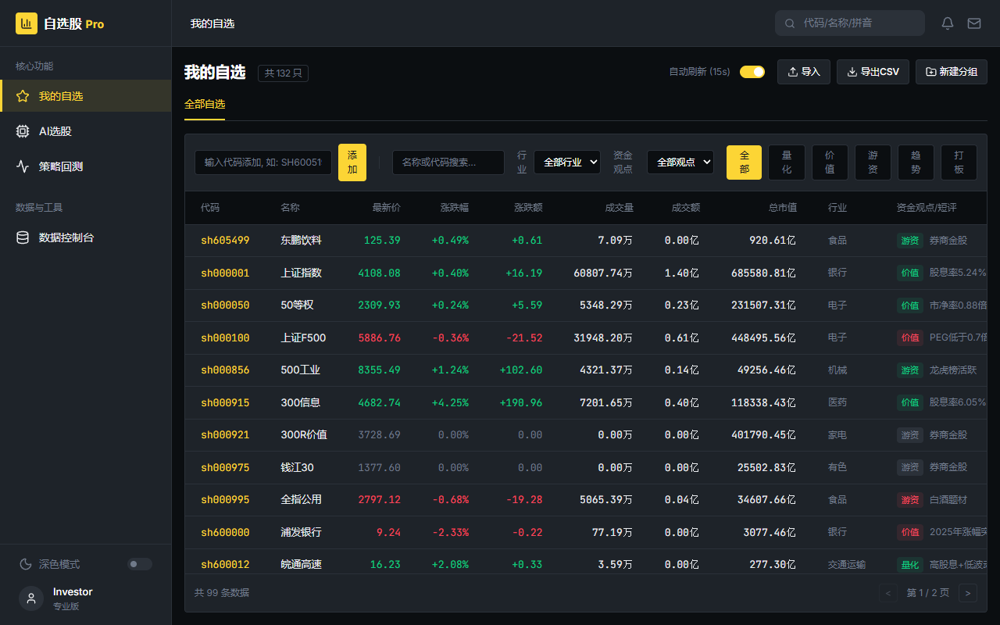
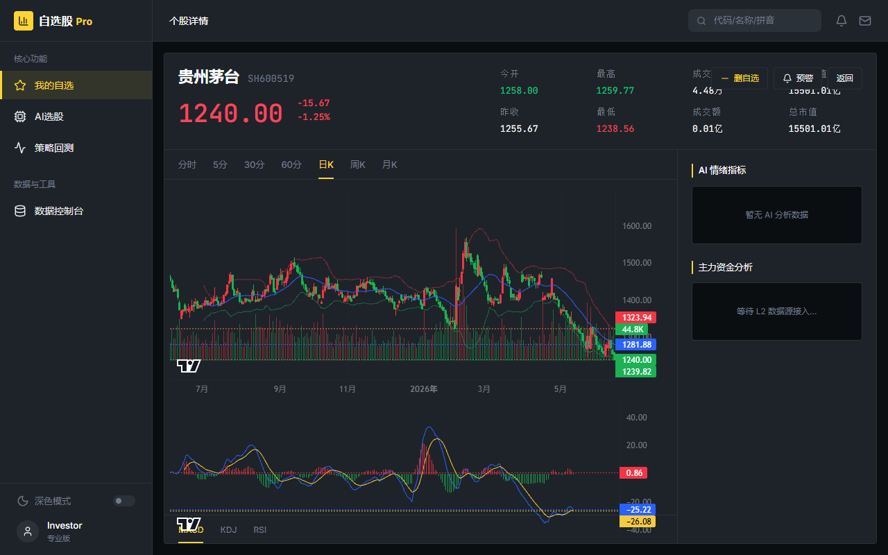
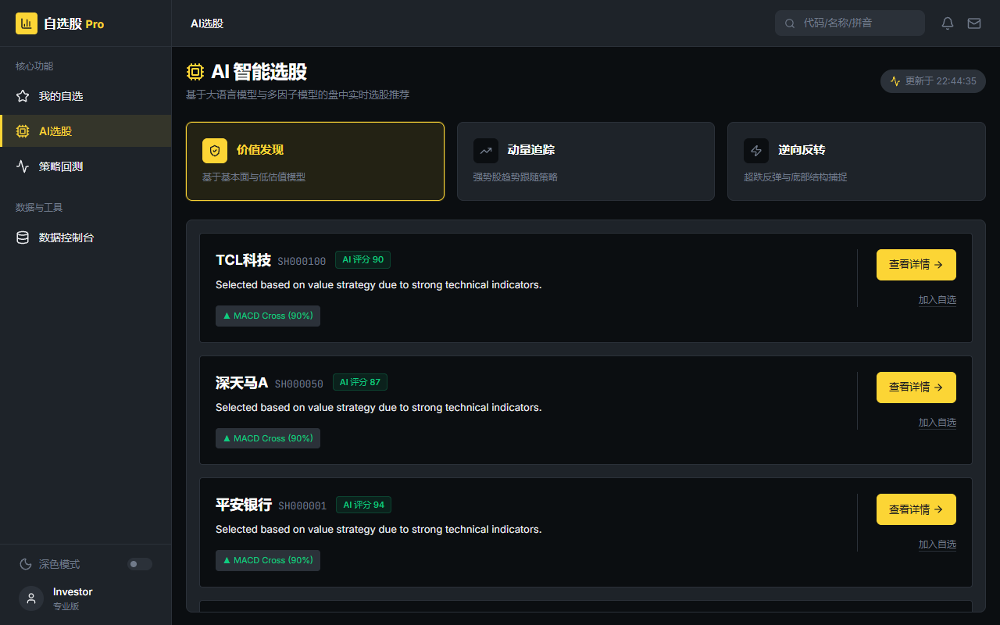
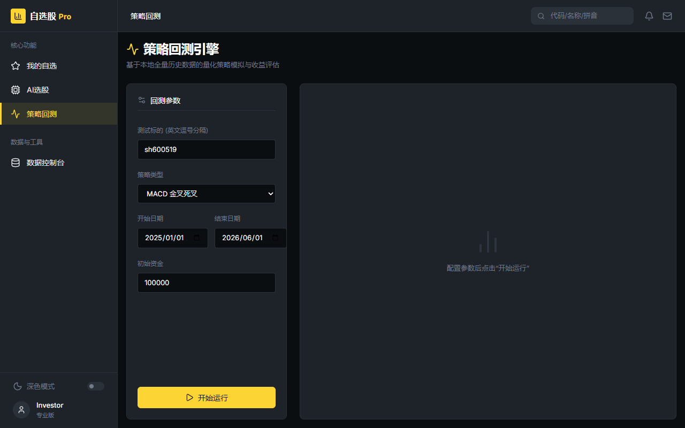

<div align="center">



# 📈 StockPulse — 股脉 · 智能投研平台

**AI-Powered CSI 300 Stock Analysis Platform**

沪深300成分股智能投研平台 — 实时行情 · 智能选股 · K线图表 · 策略回测 · 智能预警

[](LICENSE)
[](https://nodejs.org/)
[](https://react.dev/)
[](https://www.typescriptlang.org/)

</div>

---

## ✨ 核心特性

| 功能模块 | 描述 |
|---------|------|
| 📊 **实时行情** | 腾讯证券数据源，沪深300全量成分股实时行情推送 |
| ⭐ **自选管理** | 自定义股票池，分组管理，行情数据一目了然 |
| 🤖 **AI 智能选股** | Gemini AI 驱动，多维度智能筛选与分析推荐 |
| 📈 **K线图表** | 日线/分钟线专业图表，技术指标叠加（MACD / RSI / BOLL / KDJ） |
| 🧪 **策略回测** | 内置技术指标回测引擎，可视化收益曲线与绩效评估 |
| 🔔 **智能预警** | 自定义预警规则，SSE 实时推送通知 |
| 💾 **数据同步** | 历史K线批量爬取，本地 SQLite 持久化存储 |

## 🏗️ 技术架构

```
StockPulse
├── 前端 — React 19 + Vite 6 + TailwindCSS 4 + Recharts + Lightweight Charts
├── 后端 — Express 4 + Node.js + TypeScript
├── 数据库 — SQLite (better-sqlite3 + Drizzle ORM)
├── AI引擎 — Google Gemini API (@google/genai)
└── 数据源 — 腾讯证券 (qt.gtimg.cn / web.ifzq.gtimg.cn)
```

## 🚀 快速开始

### 环境要求

- **Node.js** >= 22
- **pnpm** (推荐) 或 npm

### 安装与运行

```bash
# 克隆仓库
git clone https://github.com/your-username/stockpulse.git
cd stockpulse

# 安装依赖
pnpm install

# 配置环境变量
cp .env.example .env.local
# 编辑 .env.local，填入你的 GEMINI_API_KEY

# 启动开发服务器
pnpm dev
```

访问 `http://localhost:5173` 即可体验。

## 📸 功能预览

| 数据控制台 | 自选股池 |
|:---------:|:-------:|
|  |  |

| 个股详情 | AI智能选股 |
|:-------:|:---------:|
|  |  |

| 策略回测 |
|:-------:|
|  |

## 📁 项目结构

```
stockpulse/
├── src/                    # 前端源码
│   ├── components/         # 通用组件（Layout、K线图、UI组件库）
│   ├── pages/              # 页面（Dashboard、StockPool、AiPicks、Backtest）
│   ├── lib/                # 工具函数
│   └── types.ts            # TypeScript 类型定义
├── server/                 # 后端源码
│   ├── index.ts            # Express 服务入口 & API 路由
│   ├── db/                 # 数据库 Schema & 连接（Drizzle ORM）
│   └── ai/                 # Gemini AI 集成
├── data/                   # 本地数据存储（.gitignore）
├── docs/                   # 产品文档（设计规范、路线图）
├── assets/                 # 静态资源
└── index.html              # 应用入口
```

## 🛣️ 路线图

详见 [ROADMAP.md](docs/ROADMAP.md) 了解完整的产品迭代规划。

## 📄 License

[MIT](LICENSE) © StockPulse Team
