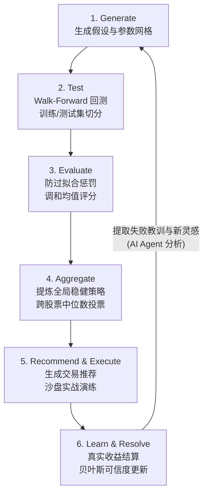

# Loop Engineering: 自动策略研究闭环系统 (AutoResearch)

## 1. 系统愿景 (Vision)
受 Karpathy 的理念启发，我们将“研究策略能否盈利”这一高度依赖人脑的科研过程，编码成一个**完全自动化的闭环系统 (generate–test–learn)**。该系统通过 AI Agent 驱动，以“不知疲倦”的形态在后台持续迭代，最终提炼出**跨股票、跨时期都稳定盈利**的最优交易策略。

我们的目标是：杜绝任何形式的数据泄露和过拟合，用真实的**样本外（Out-of-Sample）**和**实战（Real-World）**表现作为唯一试金石。

## 2. 闭环架构 (The Loop Architecture)

整个系统由 6 个核心环节组成一个生生不息的循环：

## 3. 核心机制详解

### 环节 1 & 2: Generate & Test (防未来函数的严格回测)
- **参数笛卡尔积**: 基于策略维度（如 MA 天数、止损点等）生成大量候选参数组合。
- **Walk-Forward 切分**: 拒绝全量数据回测。每只股票的数据强制切分为**前 60% (训练集)** 和 **后 40% (测试集)**。策略只能在训练集寻找最优解，然后在测试集接受检验。

### 环节 3: Evaluate (防过拟合的最严风控)
- **调和均值 (Harmonic Mean)**: `score = (2 * train * test) / (train + test)`。如果某个策略在训练集大赚（拟合极好）但在测试集亏损，算术均值可能被掩盖，但调和均值会将其打入冷宫。
- **过拟合度门槛**: 如果训练得分和测试得分差异超过 60%（`|train - test| / max(train, test) > 0.6`），直接淘汰，说明策略极不稳定。
- **置信度惩罚**: 如果在测试集交易笔数极少（如不足 5 笔），扣除置信分。

### 环节 4: Aggregate (提取“普世真理”)
单只股票的成功可能是偶然。
- 系统收集所有通过测试的策略参数（per-stock optima）。
- 计算参数的**中位数**，过滤掉极值，合成一组**全局稳健参数 (Global Optima)**。
- 计算**稳定率 (Stability Score)** = 盈利股票数 / 测试总数。只有稳定率大于 70% 的策略才会被平台采纳为“默认配置”。

### 环节 5 & 6: 沙盘实战与贝叶斯学习 (Learn)
- **推荐生成**: 用聚合后的稳健策略，结合当天的实时 K 线，生成每日买卖信号。
- **真实结算**: 记录每一次信号，并追踪后续几天的真实价格走势（触发止盈/止损/超时）。
- **贝叶斯可信度更新**: 
  - `先验概率`：回测得出的胜率和收益率。
  - `后验表现`：真实推荐落地后的盈亏。
  - `融合权重`：随着真实样本（Real Sample）的增加，后验权重逐渐升高，挤压先验权重。
  - **结果**: 如果一个策略回测完美但实战亏钱，它的综合可信度 (Blended Credibility) 会断崖式下跌，系统在下一轮将自动忽略它的信号。

## 4. Agent 驱动模式 (The Orchestrator)

在传统的量化系统中，这个循环是静态的（只能跑死代码）。但在 StockPulse 中，我们引入 **AI Agent 作为闭环的引擎 (Loop Engine)**：

1. **自动调度**: Agent 定期（如每周末）拉起全量历史数据，触发 `/api/research/optimize` 接口执行底层计算。
2. **分析诊断**: Agent 会审阅 `research_runs` 和 `global_strategy_optima` 产生的数据报告，发现哪些参数失效了。
3. **策略变异 (Mutation)**: Agent 被赋予修改底层 `PARAM_GRIDS`（参数搜索空间）或推荐信号权重（如降低 RSI 反转在熊市的权重）的权限，然后再次发起测试。
4. **知识沉淀**: 每次完整的 Loop 结束后，Agent 会生成一份 Research Report，总结本轮学习到的市场规律，写入 `docs/research/` 目录。

这构成了一个真正的**强化学习系统**：平台不仅在执行策略，还在“自我进化”。
