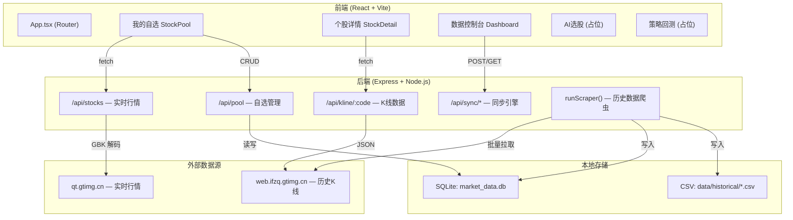
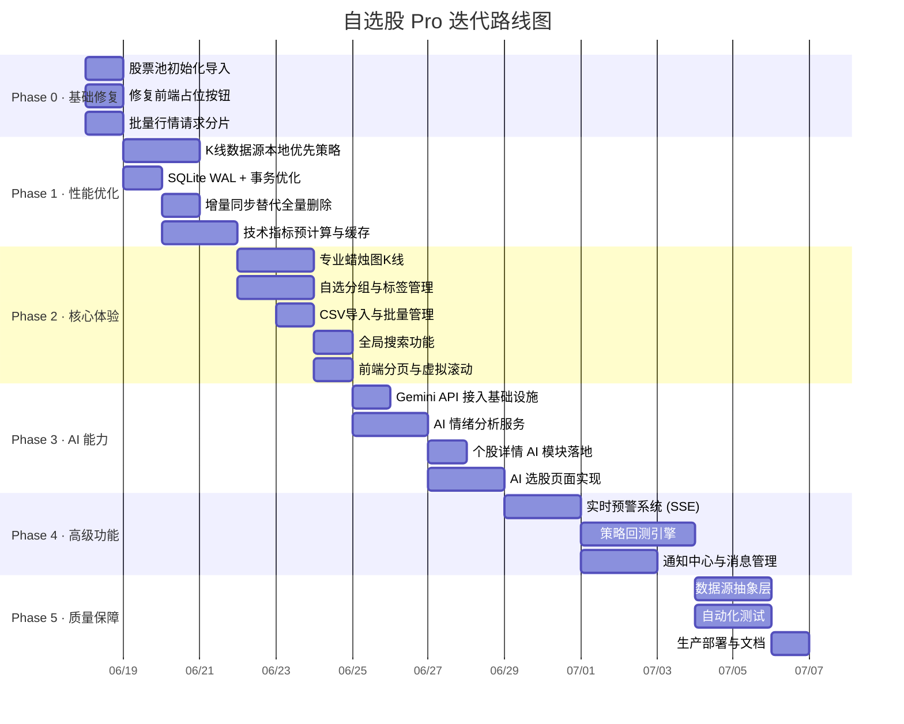

# StockPulse 股脉 — 产品迭代路线图与技术规划

> **文档版本**: v1.0.0
> **创建日期**: 2026-06-17
> **适用工程**: `stockpulse`
> **技术栈**: React 19 + Vite 6 + Express 4 + SQLite (better-sqlite3 + Drizzle ORM) + Tailwind CSS 4

---

## 一、项目现状总览

### 1.1 架构概览



### 1.2 已完成功能清单

| 模块 | 功能 | 状态 | 备注 |
|------|------|------|------|
| 自选管理 | 添加/删除自选股 | ✅ 完成 | 单只添加，支持代码输入 |
| 自选管理 | 自选列表展示 | ✅ 完成 | 实时行情轮询 (15s) |
| 自选管理 | 导出 CSV | ✅ 完成 | 含 BOM 头，Excel 友好 |
| 自选管理 | 行业/观点过滤 | ✅ 完成 | 前端本地过滤 |
| 个股详情 | 实时价格展示 | ✅ 完成 | 含开高低收、市值等 |
| 个股详情 | 多周期 K 线图 | ✅ 完成 | 分时/5分/30分/60分/日/周/月 |
| 个股详情 | 技术指标 | ✅ 完成 | MACD / KDJ / RSI / BOLL |
| 个股详情 | 加入/移出自选 | ✅ 完成 | — |
| 数据控制台 | 历史数据同步 | ✅ 完成 | 批量拉取日K + 分钟K |
| 数据控制台 | 同步进度监控 | ✅ 完成 | 实时日志 + 进度条 |
| 数据控制台 | 数据导出 (ZIP) | ✅ 完成 | CSV 打包下载 |

### 1.3 未完成/占位功能

| 模块 | 功能 | 状态 | 备注 |
|------|------|------|------|
| AI 选股 | 智能选股页面 | 🔲 占位 | 仅静态 Placeholder |
| 策略回测 | 回测系统页面 | 🔲 占位 | 仅静态 Placeholder |
| 自选管理 | 导入功能 | 🔲 占位 | 按钮绑定了导出逻辑 |
| 自选管理 | 分组管理 | 🔲 占位 | 按钮绑定了导出逻辑 |
| 自选管理 | 分页 | 🔲 占位 | 纯静态 HTML |
| 个股详情 | AI 情绪指标 | 🔲 占位 | 写死值 68 |
| 个股详情 | 主力资金分析 | 🔲 占位 | 显示"数据采集中" |
| 个股详情 | 预警设置 | 🔲 占位 | 按钮无交互 |
| 全局 | 搜索功能 | 🔲 占位 | 顶部搜索框无交互 |
| 全局 | 通知中心 | 🔲 占位 | 铃铛/邮件图标无交互 |

---

## 二、初始股票池

> 股票池来源：`data/deepseek_csv_20260617_1a46c0.csv`
> 共计 **132 只股票**，涵盖 A 股主要板块

### 2.1 股票池概况

| 维度 | 统计 |
|------|------|
| 总数 | 132 只 |
| 覆盖行业 | 银行、食品、交通运输、化工、机械、纺织、电子、通信、公用事业、商贸、医药、家电、轻工、建材、建筑、汽车、计算机、国防军工、煤炭、有色、钢铁、石油石化、非银金融、农林、社会服务、房地产、传媒 |
| 投资观点 | 价值 / 量化 / 游资 / 趋势 / 打板 / 成长 |

### 2.2 资金观点分布

| 观点 | 数量 | 典型标的 |
|------|------|----------|
| 价值 | ~55 | 招商银行、贵州茅台、工商银行、济川药业 |
| 游资 | ~42 | 东百集团、合富中国、美邦股份、安记食品 |
| 量化 | ~25 | 中国平安、海螺水泥、万华化学、兆易创新 |
| 价值+量化 | ~12 | 美的集团、海澜之家、中国神华 |
| 游资+量化 | ~3 | 比亚迪 |

### 2.3 初始化方案

系统启动时需要从 CSV 文件自动导入股票池到 SQLite 数据库。实现方式：

1. 后端启动时检查 `stocks` 表是否为空
2. 若为空，读取 `data/deepseek_csv_20260617_1a46c0.csv`
3. 解析 CSV 并批量 upsert 到 `stocks` 表（含 `view`、`industry`、`remarks` 字段）
4. 同时提供 `/api/pool/import` 接口供前端手动触发 CSV 导入

---

## 三、问题诊断与风险清单

### 3.1 性能屏障

| 编号 | 问题 | 严重度 | 影响范围 |
|------|------|--------|----------|
| P-01 | `/api/kline/:code` 不读本地 DB，每次穿透到外部 API | 🔴 Critical | 详情页每次切换周期都走外网，响应慢、CPU 高 |
| P-02 | 技术指标（MACD/RSI/BOLL/KDJ）在请求时实时计算 | 🟠 High | 大量数据点时 CPU 密集 |
| P-03 | SQLite 批量写入没有 Transaction 包裹 | 🟠 High | 写入慢、可能锁库 |
| P-04 | 全量 DELETE + INSERT 替代增量更新 | 🟡 Medium | 浪费 I/O，数据断裂风险 |
| P-05 | `syncProcess` 全局变量状态，重启即丢失 | 🟡 Medium | 无法断点续传 |
| P-06 | 前端大列表无虚拟滚动 | 🟡 Medium | 132 只股票一次性渲染 |

### 3.2 数据拉取风险

| 编号 | 风险 | 严重度 | 缓解措施 |
|------|------|--------|----------|
| D-01 | 132 只股票拼接单个 URL 可能超长 | 🔴 Critical | 需分片请求 |
| D-02 | 依赖腾讯非公开 API，可能随时变更或下线 | 🟠 High | 需数据源抽象层 |
| D-03 | 请求频率过高可能触发 IP 封禁 | 🟠 High | 需令牌桶 + 代理池 |
| D-04 | GBK 编码解码依赖 iconv-lite，异常字符可能丢失 | 🟡 Medium | 需健壮性测试 |
| D-05 | 分钟 K 线的 catch 块为空，静默吞错误 | 🟡 Medium | 需错误日志 |

### 3.3 前端 UI 风险

| 编号 | 问题 | 严重度 |
|------|------|--------|
| U-01 | 导入/分组按钮绑定了错误的 handler | 🟠 High |
| U-02 | 分页控件为纯静态 HTML | 🟡 Medium |
| U-03 | Dashboard Tab 栏无交互 | 🟡 Medium |
| U-04 | 顶部搜索框无功能 | 🟡 Medium |
| U-05 | K 线图使用 Recharts Line 而非专业 K 线（蜡烛图） | 🟡 Medium |

---

## 四、迭代规划

### 总体路线



---

### Phase 0 · 基础修复（立即执行）

> **目标**: 消除所有"占位"假交互，初始化股票池，确保系统可用性

#### Task 0.1 — 股票池初始化导入

**描述**: 在后端启动时从 `deepseek_csv_20260617_1a46c0.csv` 自动导入 132 只股票到 `stocks` 表

**涉及文件**:
- `server/db/index.ts` — 添加初始化逻辑
- `server/index.ts` — 添加 `/api/pool/import` 接口

**实现要点**:
```
1. 在 db/index.ts 中，建表后检查 stocks 表行数
2. 若行数 = 0，读取 CSV 文件，逐行解析 tencent_code, code, name, view, industry, remarks
3. 批量 upsert 到 stocks 表 (onConflictDoUpdate)
4. 使用 Transaction 包裹批量操作
5. 提供 /api/pool/import POST 接口，接收 CSV 文件上传或指定文件路径
```

**验收标准**:
- [ ] 首次启动后 `stocks` 表有 132 条记录
- [ ] 每条记录的 `view`、`industry`、`remarks` 字段正确填充
- [ ] 重复启动不会产生重复数据

---

#### Task 0.2 — 修复前端占位按钮

**描述**: 解绑所有指向错误 handler 的按钮，隐藏或标记未实现功能

**涉及文件**:
- `src/pages/StockPool.tsx` — 修复导入/分组按钮

**实现要点**:
```
1. "导入" 按钮：改为打开文件选择对话框（accept=".csv"），调用 /api/pool/import
2. "新建分组" 按钮：暂时标记为 disabled + tooltip "即将上线"
3. 分页控件：实现真实的前端分页（每页 50 条）
4. Dashboard Tab 栏：隐藏未实现的 Tab 或标记为"开发中"
```

**验收标准**:
- [ ] 无按钮绑定到错误的 handler
- [ ] 禁用按钮有视觉提示（opacity、cursor）
- [ ] 分页可正常翻页

---

#### Task 0.3 — 批量行情请求分片

**描述**: 防止 132 只股票拼成超长 URL

**涉及文件**:
- `server/index.ts` — 修改 `/api/stocks` handler

**实现要点**:
```
1. 将传入的 codes 按 30 个一组拆分
2. 对每组并发请求 qt.gtimg.cn
3. 合并结果后返回前端
4. 每组之间添加 100ms 间隔防止突发
```

**验收标准**:
- [ ] 132 只股票能正常获取实时行情
- [ ] 单个请求 URL 长度不超过 2000 字符
- [ ] 接口响应时间 < 3 秒

---

### Phase 1 · 性能优化

> **目标**: 消除核心性能瓶颈，让系统在 132+ 只股票的规模下流畅运行

#### Task 1.1 — K 线数据源本地优先策略

**描述**: 重构 `/api/kline/:code`，日 K 和分钟 K 优先从本地 SQLite 读取

**涉及文件**:
- `server/index.ts` — 重构 `/api/kline/:code` handler

**实现逻辑**:
```
GET /api/kline/:code?period=day

1. 查询 kline_daily 表，获取该 code 的最新日期 latestDate
2. 如果 latestDate 就是今天（交易日），直接返回本地数据
3. 如果 latestDate < 今天，向外部 API 拉取增量数据
4. 将增量数据写入 kline_daily 并计算指标
5. 合并本地 + 增量数据返回
6. 分钟 K 线（m30/m60）同理查 kline_min 表

对于 time/m1/m5/m15 等高频周期（数据量小、实时性要求高）：
- 仍然走外部 API 实时获取，不做本地缓存
```

**验收标准**:
- [ ] 已同步的日 K 数据直接从 DB 返回，响应时间 < 100ms
- [ ] 缺失日期自动增量补充
- [ ] 分钟 K 线在有本地数据时优先使用

---

#### Task 1.2 — SQLite WAL 模式 + 事务优化

**描述**: 启用 WAL 模式提升并发读写性能，所有批量写入包裹在 Transaction 中

**涉及文件**:
- `server/db/index.ts` — 启用 WAL + pragma 优化
- `server/index.ts` — 在 `runScraper` 中使用 Transaction

**实现要点**:
```typescript
// db/index.ts 启动时
sqlite.pragma('journal_mode = WAL');
sqlite.pragma('synchronous = NORMAL');
sqlite.pragma('cache_size = -64000'); // 64MB cache

// server/index.ts runScraper 中
const insertBatch = db.transaction((records) => {
  db.delete(klineDaily).where(eq(klineDaily.marketCode, code)).run();
  for (let c = 0; c < records.length; c += 500) {
    db.insert(klineDaily).values(records.slice(c, c + 500)).run();
  }
});
insertBatch(dbRecords);
```

**验收标准**:
- [ ] `PRAGMA journal_mode` 返回 `wal`
- [ ] 同步 132 只股票时无锁库报错
- [ ] 写入速度提升 30%+

---

#### Task 1.3 — 增量同步替代全量删除

**描述**: 同步历史数据时，仅拉取并插入新增的日期，而非每次 DELETE 全部再 INSERT

**涉及文件**:
- `server/index.ts` — 修改 `runScraper` 逻辑

**实现逻辑**:
```
1. 查询本地 kline_daily 中该 code 的 MAX(date)
2. 向外部 API 请求数据时，只取 > MAX(date) 的部分
3. 如果 MAX(date) 为空（首次同步），执行全量插入
4. 使用 INSERT OR REPLACE 避免主键冲突
5. 重新计算增量数据涉及的技术指标（注意：MACD 等需要前序数据）
```

**验收标准**:
- [ ] 二次同步时只新增缺失日期的记录
- [ ] 技术指标在增量场景下计算正确
- [ ] 同步时间从 ~15 分钟缩短至 < 3 分钟（二次同步）

---

#### Task 1.4 — 技术指标预计算与缓存

**描述**: 将 MACD/RSI/BOLL/KDJ 的计算结果持久化到 DB，避免每次请求实时计算

**涉及文件**:
- `server/index.ts` — 修改 `/api/kline/:code` 和 `runScraper`
- `server/db/schema.ts` — 为 `kline_min` 表添加指标字段

**实现要点**:
```
1. kline_min 表新增 macd/rsi/boll/kdj 字段（ALTER TABLE 或迁移脚本）
2. runScraper 同步分钟K时同步计算指标并写入
3. /api/kline/:code 返回 day/m30/m60 数据时直接从 DB 读取已计算的指标
4. 仅对 time/m1/m5/m15 实时数据在内存中计算指标
```

**验收标准**:
- [ ] 日 K 和分钟 K 的指标从 DB 直读，无运行时计算
- [ ] `/api/kline/:code?period=day` 响应时间 < 150ms

---

### Phase 2 · 核心体验提升

> **目标**: 补齐核心交互功能，让产品达到 MVP+ 水准

#### Task 2.1 — 专业蜡烛图 K 线

**描述**: 将当前的 Recharts Line 图替换为专业的蜡烛图（Candlestick）

**方案选型**:
- 方案 A: 基于 Recharts `customizedShape` 自定义蜡烛图
- 方案 B: 引入 `lightweight-charts`（TradingView 开源 K 线库）
- **推荐方案 B**：`lightweight-charts` 更轻量、更专业，原生支持蜡烛图、技术指标叠加、十字光标

**涉及文件**:
- `src/components/StockDetails.tsx` — 重写图表部分
- `package.json` — 添加 `lightweight-charts` 依赖

**验收标准**:
- [ ] 蜡烛图正确显示开高低收
- [ ] 红涨绿跌配色一致
- [ ] 支持缩放与拖拽
- [ ] 技术指标叠加显示在子图

---

#### Task 2.2 — 自选分组与标签管理

**描述**: 允许用户创建自定义分组（如"高股息"、"游资活跃"），并将股票归属到不同分组

**数据库变更**:
```sql
CREATE TABLE IF NOT EXISTS stock_groups (
  id INTEGER PRIMARY KEY AUTOINCREMENT,
  name TEXT NOT NULL UNIQUE,
  color TEXT DEFAULT '#2962ff',
  sort_order INTEGER DEFAULT 0,
  created_at INTEGER
);

-- stocks 表新增字段
ALTER TABLE stocks ADD COLUMN group_id INTEGER REFERENCES stock_groups(id);
```

**API 设计**:
```
GET    /api/groups           — 获取所有分组
POST   /api/groups           — 创建分组 { name, color }
PUT    /api/groups/:id       — 修改分组
DELETE /api/groups/:id       — 删除分组（其下股票归入"默认"）
PUT    /api/pool/:code/group — 修改股票所属分组 { groupId }
```

**前端交互**:
- StockPool 顶部 Tab 栏根据分组动态渲染
- 支持拖拽排序分组
- 删除分组时二次确认

**验收标准**:
- [ ] 可创建/编辑/删除分组
- [ ] 股票可在分组间移动
- [ ] Tab 切换过滤正常

---

#### Task 2.3 — CSV 导入与批量管理

**描述**: 实现前端 CSV 文件上传 + 后端解析导入的完整流程

**涉及文件**:
- `src/pages/StockPool.tsx` — 添加文件上传 UI
- `server/index.ts` — 添加 `/api/pool/import` 接口

**支持的 CSV 格式**:
```csv
tencent_code,code,name,view,industry,remarks
sh600519,600519,贵州茅台,量化,食品,成交额居前
```

**实现要点**:
```
1. 前端：<input type="file" accept=".csv"> + FileReader 读取
2. 后端：解析 CSV 行，对每行执行 upsert
3. 支持 GBK 和 UTF-8 编码的 CSV 文件
4. 导入结果反馈：成功 N 条，跳过 M 条，失败 K 条
```

**验收标准**:
- [ ] 上传 `deepseek_csv_20260617_1a46c0.csv` 可成功导入 132 条
- [ ] 重复导入不产生重复记录
- [ ] 导入进度有 UI 反馈

---

#### Task 2.4 — 全局搜索功能

**描述**: 实现顶部搜索框的实时搜索功能

**涉及文件**:
- `src/components/Layout.tsx` — 搜索框交互
- `server/index.ts` — 添加 `/api/search` 接口

**实现要点**:
```
GET /api/search?q=茅台

1. 后端在 stocks 表中搜索 name LIKE '%茅台%' OR market_code LIKE '%茅台%'
2. 返回匹配结果列表（最多 10 条）
3. 前端使用 debounce (300ms) 触发搜索
4. 下拉列表展示搜索结果，点击跳转到详情页
```

**验收标准**:
- [ ] 输入后 300ms 自动搜索
- [ ] 支持代码/名称/拼音首字母搜索
- [ ] 点击结果项跳转到 `/pool/:code`

---

#### Task 2.5 — 前端分页与虚拟滚动

**描述**: 为自选列表实现真实的分页或虚拟滚动

**涉及文件**:
- `src/pages/StockPool.tsx` — 分页逻辑

**实现要点**:
```
方案A（简单分页）：
- 前端状态 currentPage + pageSize (50)
- 切片 filteredStocks.slice((page-1)*50, page*50)
- 分页控件支持跳页

方案B（虚拟滚动）：
- 引入 @tanstack/react-virtual
- 仅渲染可视区域的行
- 适合 500+ 只股票的场景
```

**推荐先做方案 A（分页），后续按需引入虚拟滚动**

**验收标准**:
- [ ] 分页控件可翻页，显示总页数
- [ ] 页码状态与 URL query 同步（可选）
- [ ] 切换过滤条件时重置到第一页

---

### Phase 3 · AI 能力建设

> **目标**: 利用 Gemini API 接入 AI 分析能力，落地 AI 情绪分析与智能选股

#### Task 3.1 — Gemini API 接入基础设施

**描述**: 搭建后端 AI 服务调用层

**涉及文件**:
- `server/ai/index.ts` — 新建 AI 服务模块
- `.env.example` — 文档化 `GEMINI_API_KEY`

**实现要点**:
```typescript
// server/ai/index.ts
import { GoogleGenerativeAI } from '@google/genai';

const genAI = new GoogleGenerativeAI(process.env.GEMINI_API_KEY);

export async function analyzeStock(stockName: string, klineData: any[], context: string) {
  const model = genAI.getGenerativeModel({ model: 'gemini-2.0-flash' });
  const prompt = buildAnalysisPrompt(stockName, klineData, context);
  const result = await model.generateContent(prompt);
  return parseAIResponse(result.response.text());
}
```

**验收标准**:
- [ ] 可成功调用 Gemini API
- [ ] 有请求限流（1 req/s）和错误重试
- [ ] API Key 通过环境变量注入

---

#### Task 3.2 — AI 情绪分析服务

**描述**: 对自选股进行 AI 情绪分析，输出量化评分和文字简评

**API 设计**:
```
GET /api/ai/sentiment/:code

Response:
{
  "score": 72,           // 0-100 情绪分
  "label": "积极",       // 积极/中性/消极
  "summary": "近期量价齐升，主力资金持续流入...",
  "signals": [
    { "type": "bullish", "name": "MACD 金叉", "confidence": 0.85 },
    { "type": "bearish", "name": "RSI 超买区", "confidence": 0.60 }
  ],
  "updatedAt": "2026-06-18T10:30:00Z"
}
```

**Prompt 工程**:
```
给 AI 提供：
1. 最近 60 日 K 线数据（OHLCV + 指标值）
2. 当日实时行情数据
3. 股票基本面信息（PE/PB/市值）

要求 AI 返回 JSON 格式的分析结果
```

**缓存策略**:
- 新增 `ai_sentiment` 表存储分析结果
- 每只股票每天最多分析 2 次（盘中 + 收盘后）
- 缓存有效期 4 小时

**验收标准**:
- [ ] 情绪分析结果结构完整
- [ ] 有本地缓存，避免重复调用
- [ ] 错误降级：API 不可用时显示"暂无分析"

---

#### Task 3.3 — 个股详情 AI 模块落地

**描述**: 将 AI 情绪分析结果展示在个股详情页右侧面板

**涉及文件**:
- `src/components/StockDetails.tsx` — 替换硬编码的 AI 情绪指标区域

**UI 设计**:
```
┌─────────────────────────┐
│ AI 情绪指标              │
│ ┌─────────────────────┐ │
│ │     72 / 100        │ │
│ │    ■■■■■■■□□□       │ │
│ │    情绪: 积极        │ │
│ └─────────────────────┘ │
│                         │
│ 📊 技术信号             │
│  ▲ MACD 金叉 (85%)     │
│  ▼ RSI 超买区 (60%)    │
│                         │
│ 💬 AI 点评              │
│ "近期量价齐升，主力     │
│  资金持续流入..."       │
│                         │
│ 更新于 10:30            │
└─────────────────────────┘
```

**验收标准**:
- [ ] 进入详情页自动请求 AI 分析
- [ ] 加载中/错误/成功三种状态正确展示
- [ ] 数据来自后端而非硬编码

---

#### Task 3.4 — AI 选股页面实现

**描述**: 实现 `/ai-picks` 页面，通过 AI 从股票池中筛选推荐

**API 设计**:
```
POST /api/ai/picks
Body: { strategy: "value" | "momentum" | "contrarian", count: 10 }

Response:
{
  "picks": [
    {
      "marketCode": "sh600519",
      "name": "贵州茅台",
      "score": 92,
      "reason": "估值合理，技术面强势...",
      "signals": [...]
    }
  ],
  "generatedAt": "2026-06-18T10:30:00Z"
}
```

**前端页面设计**:
- 策略选择卡片（价值投资 / 动量追踪 / 逆向投资）
- AI 推荐结果列表（含评分 + 理由 + 信号）
- 一键加入自选功能
- 历史推荐记录

**验收标准**:
- [ ] 至少支持 3 种选股策略
- [ ] 推荐结果含评分和理由
- [ ] 可从推荐列表直接添加到自选

---

### Phase 4 · 高级功能

> **目标**: 打造专业级交易辅助工具

#### Task 4.1 — 实时预警系统 (SSE)

**描述**: 允许用户对自选股设置价格/涨跌幅阈值预警

**数据库变更**:
```sql
CREATE TABLE IF NOT EXISTS alerts (
  id INTEGER PRIMARY KEY AUTOINCREMENT,
  market_code TEXT NOT NULL,
  type TEXT NOT NULL,            -- 'price_above', 'price_below', 'change_above', 'change_below'
  threshold REAL NOT NULL,
  is_triggered INTEGER DEFAULT 0,
  is_active INTEGER DEFAULT 1,
  created_at INTEGER,
  triggered_at INTEGER
);
```

**技术方案**:
```
1. 后端定时任务（每 30 秒）拉取自选股最新价格
2. 检查是否触发预警条件
3. 通过 SSE (Server-Sent Events) 推送到前端
4. 前端接收推送后弹出 Notification + 铃铛角标

SSE 端点: GET /api/alerts/stream
```

**验收标准**:
- [ ] 可设置 4 种预警类型
- [ ] 触发后实时推送到前端（延迟 < 30s）
- [ ] 铃铛图标显示未读数量
- [ ] 预警记录可查看历史

---

#### Task 4.2 — 策略回测引擎

**描述**: 基于本地历史数据，实现简易版策略回测

**API 设计**:
```
POST /api/backtest/run
Body: {
  "codes": ["sh600519", "sh601318"],
  "strategy": {
    "type": "macd_cross",        // 策略类型
    "params": {
      "fastPeriod": 12,
      "slowPeriod": 26,
      "signalPeriod": 9
    }
  },
  "startDate": "2025-01-01",
  "endDate": "2026-06-01",
  "initialCapital": 100000
}

Response:
{
  "totalReturn": 0.234,
  "annualizedReturn": 0.156,
  "maxDrawdown": -0.089,
  "sharpeRatio": 1.42,
  "winRate": 0.65,
  "trades": [...],
  "equityCurve": [...]
}
```

**前端页面设计**:
- 策略配置面板（策略类型 + 参数 + 时间范围 + 初始资金）
- 收益率曲线图（对比基准指数）
- 交易记录表格
- 关键指标仪表盘（年化收益、最大回撤、夏普比率、胜率）

**内置策略**:
1. MACD 金叉/死叉
2. RSI 超买超卖
3. 布林带突破
4. 双均线交叉（MA5/MA20）

**验收标准**:
- [ ] 至少支持 4 种内置策略
- [ ] 回测结果含完整的统计指标
- [ ] 收益率曲线可视化
- [ ] 回测时间 < 5 秒（单只股票 2000 日数据）

---

#### Task 4.3 — 通知中心与消息管理

**描述**: 实现导航栏铃铛图标的通知中心

**涉及文件**:
- `src/components/Layout.tsx` — 通知面板 UI
- `server/index.ts` — 通知 API

**通知类型**:
| 类型 | 触发条件 | 图标 |
|------|----------|------|
| 预警触发 | 价格达到阈值 | 🔔 |
| 同步完成 | 历史数据同步结束 | ✅ |
| AI 分析完成 | 批量 AI 分析结束 | 🤖 |
| 系统通知 | 版本更新等 | ℹ️ |

**验收标准**:
- [ ] 通知面板下拉展示
- [ ] 未读计数角标
- [ ] 标记已读/全部已读
- [ ] 通知持久化到 DB

---

### Phase 5 · 质量保障

> **目标**: 提升系统健壮性与可维护性

#### Task 5.1 — 数据源抽象层

**描述**: 将腾讯 API 的调用封装为可替换的 DataProvider 接口

**设计模式**:
```typescript
// server/data-providers/types.ts
interface IMarketDataProvider {
  name: string;
  fetchRealtimeQuotes(codes: string[]): Promise<QuoteData[]>;
  fetchKline(code: string, period: string, count: number): Promise<KlineData[]>;
}

// server/data-providers/tencent.ts
class TencentDataProvider implements IMarketDataProvider { ... }

// 未来可扩展
// server/data-providers/eastmoney.ts
class EastMoneyDataProvider implements IMarketDataProvider { ... }
```

**验收标准**:
- [ ] 数据源可通过配置切换
- [ ] 新增数据源只需实现接口
- [ ] 现有功能无回归

---

#### Task 5.2 — 自动化测试

**描述**: 为核心模块添加单元测试和集成测试

**测试覆盖**:
| 模块 | 测试类型 | 关注点 |
|------|----------|--------|
| 行情解析 | 单元测试 | `parseTencentStockData` GBK 解码正确性 |
| 指标计算 | 单元测试 | MACD/RSI/BOLL/KDJ 计算精度 |
| API 接口 | 集成测试 | CRUD 操作 + 错误处理 |
| 数据同步 | 集成测试 | 增量同步正确性 |

**验收标准**:
- [ ] 核心模块测试覆盖率 > 70%
- [ ] CI 中可自动运行测试

---

#### Task 5.3 — 生产部署与文档

**描述**: 完善生产构建流程和项目文档

**交付物**:
- 更新 `README.md`：项目介绍、架构图、快速开始
- 新建 `docs/DEPLOYMENT.md`：部署指南
- 新建 `docs/API.md`：完整 API 文档
- 优化 `build` 脚本：环境变量注入、静态资源压缩

---

## 五、技术债务追踪

| 编号 | 描述 | 引入时间 | 优先级 | 计划解决阶段 |
|------|------|----------|--------|-------------|
| TD-01 | `import('drizzle-orm')` 多处动态导入，应改为顶层 import | 初始版本 | Low | Phase 1 |
| TD-02 | `constants.ts` 中硬编码的 CSI_300 列表已不使用 | 初始版本 | Low | Phase 0 |
| TD-03 | 分钟 K 线同步的 catch 块为空 `catch(e) {}` | 初始版本 | Medium | Phase 1 |
| TD-04 | `parseTencentStockData` 缺少类型定义，返回 `any[]` | 初始版本 | Low | Phase 5 |
| TD-05 | 无错误监控和日志持久化 | 初始版本 | Medium | Phase 5 |
| TD-06 | CSV 导出未转义含逗号的字段 | 初始版本 | Low | Phase 2 |

---

## 六、关键指标与目标

| 指标 | 当前值 | Phase 1 目标 | Phase 3 目标 |
|------|--------|-------------|-------------|
| 日 K 接口响应时间 | ~800ms (外网) | < 100ms (本地) | < 100ms |
| 132 只实时行情响应 | 可能超时 | < 3s | < 2s |
| 首次同步耗时（132只） | ~20min | ~15min | ~10min |
| 二次同步耗时 | ~20min | < 3min | < 1min |
| 前端 FCP | ~1.5s | < 1s | < 0.8s |
| 测试覆盖率 | 0% | — | > 70% |

---

## 七、风险与缓解

| 风险 | 概率 | 影响 | 缓解措施 |
|------|------|------|----------|
| 腾讯 API 封禁 | 中 | 高 | Phase 5 数据源抽象层 + 备用东方财富源 |
| Gemini API 配额不足 | 低 | 中 | 本地缓存 + 降级策略 |
| SQLite 单文件性能瓶颈 | 低 | 中 | WAL 模式 + 未来可迁移 PostgreSQL |
| 前端大量数据渲染卡顿 | 中 | 中 | 虚拟滚动 + 分页 |

---

> **文档维护**: 本文档随迭代持续更新，每个 Phase 完成后需更新对应模块的状态标记。
